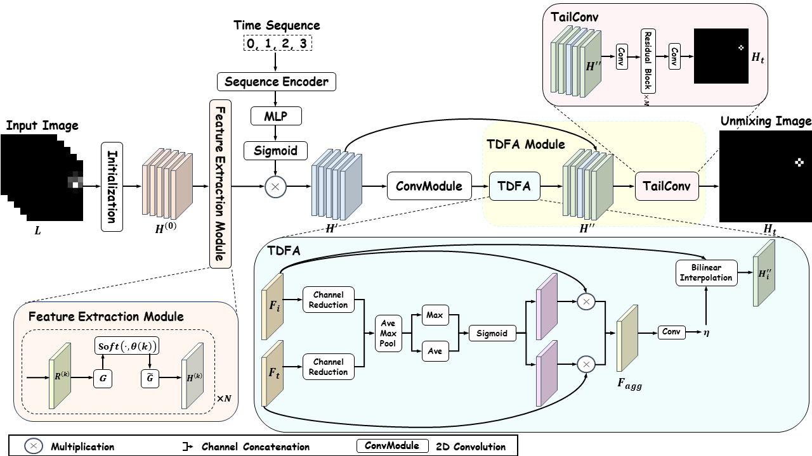

# SeqCSIST: Sequential Closely-Spaced Infrared Small Target Unmixing

## 📘 Introduction
This repository contains the official implementation of our paper **"SeqCSIST: Sequential Closely-Spaced Infrared Small Target Unmixing"**. Our work introduces:
- **A novel task**: CSIST Unmixing, which aims to detect [all targets in the form of sub-pixel localization from a highly dense CSIST group].
- **A new dataset**: SeqCSIST, specifically designed for [multi-frame CSIST Umixing].
- **An End-to-End Framework**: Our approach outperforms existing methods by [].

## 🗂 Dataset
- **Number of samples**: [100,000 frames organized into 5,000 random trajectories]
- **Download**: []

## 🔧 Model
Our model consists of three main modules:
- **[Sparsity-driven Feature Extraction module]**: []
- **[Positional Encoding module]**: []
- **[Temporal Deformable Feature Alignment (TDFA) module]**: []

### 🏗 Architecture


## ⚙ Installation
To set up the environment, run:
```bash
conda env create -f environment.yml
conda activate speed
mim install mmcv==2.0.1
```

## 🚀 Training
To train the model, run:
```bash

```

## 🎯 Evaluation
To evaluate on the test set, run:
```bash

```

## 🏆 Results
Our method achieves state-of-the-art performance on SeqCSIST Task
### 📊 Comparison with state-of-the-art methods
---

| Method                  | Params  | FLOPs    | CSO-mAP  | AP₀₅  | AP₁₀  | AP₁₅  | AP₂₀  | AP₂₅  |
| :------------------------------: | :-----: | :----: | :-----: | :---: | :---: | :---: | :---: | :---: |
| **Traditional Optimization** |          |           |           |        |        |        |        |        |
| ISTA                | -        | 398.57 M  | 10.72     | 0.14   | 1.97   | 8.74   | 18.22  | 24.53  |
| BID                 | -        | 10.89 M   | 14.40     | 0.00   | 3.00   | 13.00  | 26.00  | 30.00  |
| **Image Super-Resolution**   |          |           |           |        |        |        |        |        |
| SRCNN               | 15.84 K  | 0.35 G    | 49.64     | 1.40   | 16.30  | 51.20  | 85.00  | 94.30  |
| GMFN                | 2.80 M   | 27.53 G   | 50.94     | 0.70   | 11.90  | 51.20  | 92.10  | 98.80  |
| DBPN                | 1.96 M   | 4.75 G    | 50.40     | 0.80   | 12.50  | 51.20  | 90.00  | 97.40  |
| SRGAN               | 35.31 M  | 40.274 G  | 26.96     | 0.30   | 3.90   | 19.40  | 46.90  | 64.30  |
| BSRGAN              | 36.06 M  | 0.266 T   | 33.21     | 0.40   | 6.10   | 27.50  | 57.20  | 74.90  |
| ESRGAN              | 50.45 M  | 0.375 T   | 36.86     | 0.40   | 6.00   | 30.30  | 66.80  | 80.70  |
| RDN                 | 22.31 M  | 53.97 G   | 49.61     | 0.70   | 10.60  | 48.20  | 90.40  | 98.20  |
| EDSR                | 0.39 M   | 0.99 G    | 50.19     | 0.60   | 10.30  | 48.80  | 92.20  | 99.00  |
| ESPCN               | 54.75 M  | 22.73 K   | 47.18     | 1.60   | 15.30  | 46.60  | 80.30  | 92.00  |
| TDAN                | 0.59 M   | 2.179 G   | 47.96     | 0.50   | 8.60   | 43.80  | 89.30  | 97.50  |
| **Deep Unfolding**           |          |           |           |        |        |        |        |        |
| LIHT                | 21.10 M  | 0.42 G    | 6.36      | 0.10   | 1.00   | 4.30   | 10.40  | 16.00  |
| LAMP                | 2.13 M   | 86.97 G   | 9.09      | 0.10   | 1.50   | 6.50   | 15.00  | 22.30  |
| ISTA-Net            | 0.17 M   | 4.09 G    | 48.95     | 0.70   | 11.20  | 49.70  | 87.70  | 95.40  |
| FISTA-Net           | 74.60 K  | 6.02 G    | 50.61     | 1.00   | 12.60  | 51.40  | 90.70  | 97.30  |
| ISTA-Net+           | 0.38 M   | 7.70 G    | 51.02     | 1.00   | 13.70  | 52.70  | 90.40  | 93.70  |
| ISTA-Net++          | 0.76 M   | 16.54 G   | 50.50     | 0.70   | 10.40  | 49.20  | 92.8   | 99.40  |
| LISTA               | 21.10 M  | 0.42 G    | 9.39      | 0.10   | 1.70   | 6.90   | 15.40  | 22.70  |
| USRNet              | 1.07 M   | 11.26 G   | 49.25     | 0.70   | 9.80   | 46.60  | 91.20  | 98.90  |
| TiLISTA             | 2.22 M   | 86.97 M   | 13.52     | 0.20   | 2.10   | 9.50   | 22.60  | 33.30  |
| RPCANet             | 0.68 M   | 14.81 G   | 47.17     | 0.70   | 10.20  | 44.50  | 84.60  | 95.90  |
| **DeRefNet (Ours)**     | 0.89 M   | 15.70 G   | **51.55** | 1.00   | 14.40  | 54.90  | 90.40  | 97.10  |

### 🎥 Visualization

## 🔍 Citation
If you find this work useful, please cite our paper:
```
@article{zhai2025seqcsist,
  title={SeqCSIST: Sequential Closely-Spaced Infrared Small Target Unmixing},
  author={Ximeng Zhai, Bohan Xu, Yaohong Chen, Hao Wang, Kehua Guo, Yimian Dai},
  journal={ArXiv/IEEE Transactions on Geoscience and Remote Sensing},
  year={2025}
}
```

